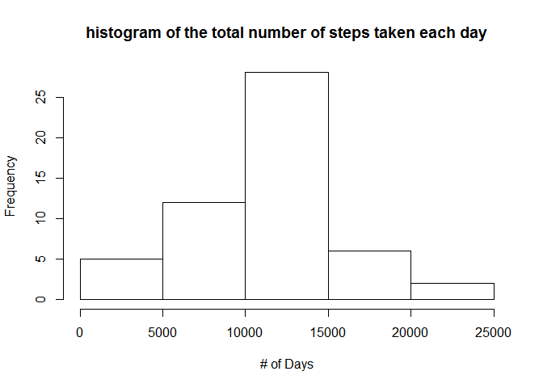
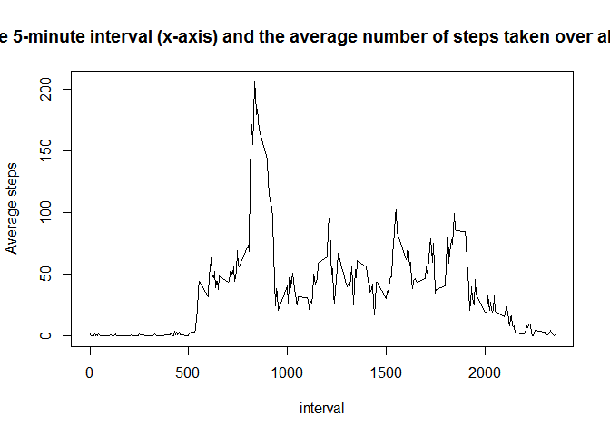
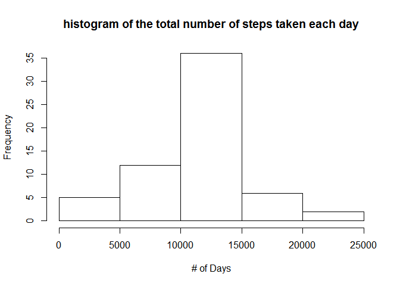
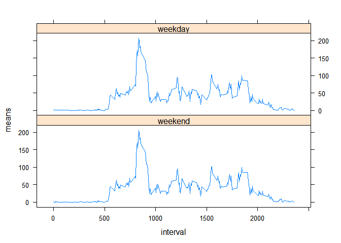

# Reproducible Research: Peer Assessment 1


## Loading and preprocessing the data
Read the Activity File

```r
Activity <<- read.csv("activity.csv")
```

Process the data (Remove NA values )


```r
ACT<<-subset(Activity, !is.na(steps))
```


## What is mean total number of steps taken per day?
1. Calculate the total number of steps taken per day
2. Make a histogram of the total number of steps taken each day

```r
      library(dplyr)
```

```
## 
## Attaching package: 'dplyr'
```

```
## The following objects are masked from 'package:stats':
## 
##     filter, lag
```

```
## The following objects are masked from 'package:base':
## 
##     intersect, setdiff, setequal, union
```

```r
        days <<- group_by(ACT, date)
        ACT1<<-summarize(days, sums = sum(steps, na.rm = TRUE))
   hist(ACT1$sums,main = "histogram of the total number of steps taken each day",xlab="# of Days")
```

<!-- -->
 
3. Calculate and report the mean and median of the total number of steps taken per day

```r
   summarize(days, The_mean = mean(steps, na.rm = TRUE),The_Median=median(steps, na.rm = TRUE))
```

```
## # A tibble: 53 × 3
##          date The_mean The_Median
##        <fctr>    <dbl>      <dbl>
## 1  2012-10-02  0.43750          0
## 2  2012-10-03 39.41667          0
## 3  2012-10-04 42.06944          0
## 4  2012-10-05 46.15972          0
## 5  2012-10-06 53.54167          0
## 6  2012-10-07 38.24653          0
## 7  2012-10-09 44.48264          0
## 8  2012-10-10 34.37500          0
## 9  2012-10-11 35.77778          0
## 10 2012-10-12 60.35417          0
## # ... with 43 more rows
```


## What is the average daily activity pattern?
1.  Make a time series plot (i.e. type = "l") of the 5-minute interval (x-axis) and the average number of steps taken, averaged across all days (y-axis)

```r
   intervals <<- group_by(ACT, interval)
   ACT3<<-summarize(intervals, means = mean(steps, na.rm = TRUE))
       plot(ACT3$interval,ACT3$means,type="l",
            main = "the 5-minute interval (x-axis) and the average number of steps taken over all days",
           xlab="interval", ylab="Average steps")
```

<!-- -->

 2.  Which 5-minute interval, on average across all the days in the dataset, contains the maximum number of steps? 

```r
       mm<-filter(ACT3, interval,means==max(ACT3$means))
       i1<-mm$interval
       i2<-mm$means
```
Interval   835 contains the maximum number of steps, which is  206.1698113


## Imputing missing values

1. Calculate and report the total number of missing values in the dataset (i.e. the total number of rows with NAs)

```r
   o1<-sum(is.na(Activity$steps))
   o2<-sum(is.na(Activity$date))
   o3<-sum(is.na(Activity$interval))
```
The number missing values in steps 2304 ,
The number missing values in steps 0 ,
The number missing values in steps 0 


2. Devise a strategy for filling in all of the missing values in the dataset. The strategy does not need to be sophisticated. For example, you could use the mean/median for that day, or the mean for that 5-minute interval, etc.
3. Create a new dataset that is equal to the original dataset but with the missing data filled in.

##The missing data was replace with the mean value over the interval

```r
    a<-data.frame(interval=ACT3$interval,means=ACT3$means)
   b<<-merge(Activity,a,all=TRUE)
   b<<-mutate(b,newsteps=ifelse(is.na(b$steps),b$means,b$steps)) 
   head(b,10)  
```

```
##    interval steps       date    means newsteps
## 1         0    NA 2012-10-01 1.716981 1.716981
## 2         0     0 2012-11-23 1.716981 0.000000
## 3         0     0 2012-10-28 1.716981 0.000000
## 4         0     0 2012-11-06 1.716981 0.000000
## 5         0     0 2012-11-24 1.716981 0.000000
## 6         0     0 2012-11-15 1.716981 0.000000
## 7         0     0 2012-10-20 1.716981 0.000000
## 8         0     0 2012-11-16 1.716981 0.000000
## 9         0     0 2012-11-07 1.716981 0.000000
## 10        0     0 2012-11-25 1.716981 0.000000
```

4. Make a histogram of the total number of steps taken each day and 
Calculate and report the mean and median total number of steps taken per day. Do these values differ from the estimates from the first part of the assignment? 
What is the impact of imputing missing data on the estimates of the total daily number of steps?   


```r
   daysb <<- group_by(b, date)
   b1<<-summarize(daysb, sums = sum(newsteps))

   hist(b1$sums,main = "histogram of the total number of steps taken each day",xlab="# of Days")
```

<!-- -->

```r
   b2<<-summarize(daysb, The_mean = mean(newsteps),The_Median=median(newsteps))
   head(b2,10)
```

```
## # A tibble: 10 × 3
##          date The_mean The_Median
##        <fctr>    <dbl>      <dbl>
## 1  2012-10-01 37.38260   34.11321
## 2  2012-10-02  0.43750    0.00000
## 3  2012-10-03 39.41667    0.00000
## 4  2012-10-04 42.06944    0.00000
## 5  2012-10-05 46.15972    0.00000
## 6  2012-10-06 53.54167    0.00000
## 7  2012-10-07 38.24653    0.00000
## 8  2012-10-08 37.38260   34.11321
## 9  2012-10-09 44.48264    0.00000
## 10 2012-10-10 34.37500    0.00000
```

## Are there differences in activity patterns between weekdays and weekends?

For this part the weekdays() function may be of some help here. Use the dataset with the filled-in missing values for this part.

Create a new factor variable in the dataset with two levels - "weekday" and "weekend" indicating whether a given date is a weekday or weekend day.


```r
   weekdays1 <- c('Monday', 'Tuesday', 'Wednesday', 'Thursday', 'Friday')
   aa<<-weekdays(as.Date(b$date) )
   b<<-mutate(b,day=factor(aa %in% weekdays1, levels=c(FALSE, TRUE), labels=c('weekend', 'weekday'))) 
```
  
   
 #Make a panel plot containing a time series plot (i.e. type = "l") of the 5-minute interval 
 #(x-axis) and the average number of steps taken, averaged across all 
 #weekday days or weekend days (y-axis). 


```r
   b1 <<- group_by(b, interval)
   b11<<-summarize(b1, means = mean(newsteps))
   library(lattice)
   xyplot(means ~ interval |day, data = b, type="l",layout = c(1, 2))
```

<!-- -->
   
##End of Report
